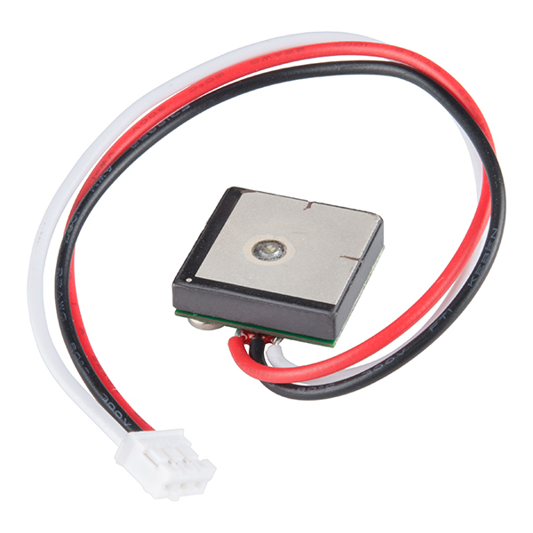

# not-kiwi-bot
Definitely not trying to copy the Kiwi Bot (https://www.kiwicampus.com/). Class project for MAE 148 at UC San Diego.

# Raspberry Pi 3 Pinout


# GPS GP-20U7


## Wiring
### GPS -> RPi
VCC -> 3.3V
GND -> GND
TX -> RX (Receiver)
RX -> NC (No Connect)


## Installations
```
pip install pyserial
```

##  Execute
``` 
$ python gps.py
```
Your output should look like this:  
```
(dk) **pi@ucsdrobocar03**:**~/not-kiwi-bot $** python gps.py
(32.88242833333334, -117.23458166666667)

(32.88242833333334, -117.23458166666667)

(32.88242833333334, -117.23458166666667)

(32.88242833333334, -117.23458166666667)
```

Debugging program running on fake data:
```
python gps.py fake
```
