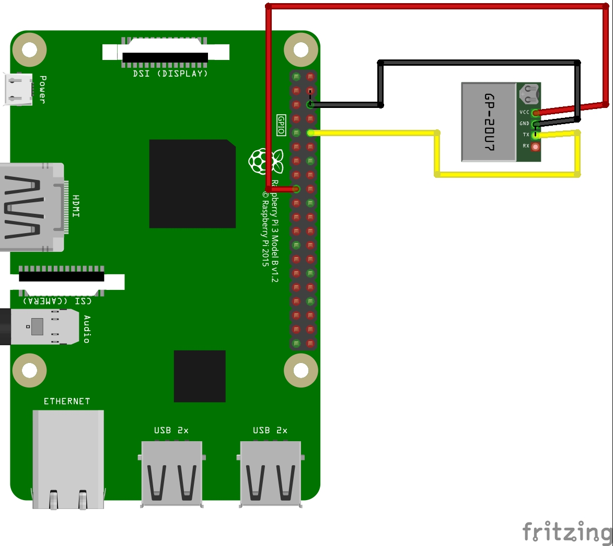

# not-kiwi-bot
Definitely not trying to copy the Kiwi Bot (https://www.kiwicampus.com/). Class project for MAE 148 at UC San Diego.

# Accreditation
## Fritzing Parts
We the GPS (GP-20U7) fritzing part from the [Johnny-Five](http://johnny-five.io/) javascript robotics platform. The author is Rick Waldron and the [johnny-five](https://github.com/rwaldron/johnny-five) repo has many fritzing parts.

# Raspberry Pi 3 Pinout


# GPS GP-20U7
GPS module from [sparkfun](https://www.sparkfun.com/products/13740).


## Wiring
### GPS -> RPi
VCC -> 3.3V
GND -> GND
TX -> RX (Receiver)
RX -> NC (No Connect)


## Installations
```
pip install pyserial
```

##  Execute
``` 
$ python gps.py
```
Your output should look like this:  
```
(dk) **pi@ucsdrobocar03**:**~/not-kiwi-bot $** python gps.py
(32.88242833333334, -117.23458166666667)

(32.88242833333334, -117.23458166666667)

(32.88242833333334, -117.23458166666667)

(32.88242833333334, -117.23458166666667)
```

Debugging program running on fake data:
```
python gps.py fake
```

# Resources and Lessons Learned
## Python
[Decoding Bytes to String](https://stackoverflow.com/questions/606191/convert-bytes-to-a-string)
[Bytes](https://stackoverflow.com/questions/6269765/what-does-the-b-character-do-in-front-of-a-string-literal)
## Raspberry Pi
[Wif Priority](https://raspberrypi.stackexchange.com/questions/58304/how-to-set-wifi-network-priority)
[Serial Ports](https://www.raspberrypi.org/documentation/configuration/uart.md) Bluetooth ON may switch serial from `/dev/ttyAMA0` to `/dev/serial0`.

